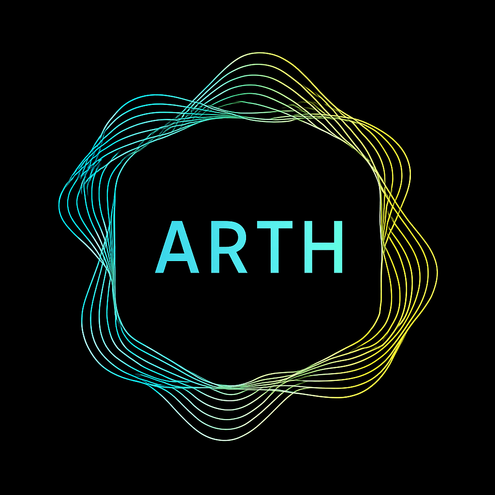

<p align="center">
  <a href="/" target="_self"></a>
</p>

  <p align="center">Arth — a focused knowledge hub for DeFi practitioners, quantitative researchers, and curious learners.</p>
    <p align="center">
<a href="https://github.com/auralshin/arth"></a>
<a href="https://github.com/auralshin/arth/blob/master/LICENSE"></a>
  <a href="https://twitter.com/arthdotclub"></a>
</p>

## Description

Arth is a focused knowledge hub for DeFi practitioners, quantitative researchers, and curious learners. Our goal is to collect clear, practical explanations of decentralized finance protocols, trading and yield strategies, and the quantitative math and modeling techniques that support them.

This repository powers the documentation site for the Arth project. It's built on top of the [Angular CLI](https://github.com/angular/angular-cli) and uses the [Dgeni documentation generator](https://github.com/angular/dgeni) to compile markdown files from the `content/` directory into the published site.

Content ranges from approachable primers to deep-dive technical explainers, organized around three core pillars:

- DeFi primers that explain how protocols and primitives work
- Strategy write-ups that describe how traders and builders capture value or design automated strategies
- Mathematical explainers and worked examples that reveal the quantitative foundations

Articles may include code snippets, math notation, diagrams, and reproducible examples in JavaScript, TypeScript, or Python.

## Installing

Install project dependencies and start a local server with the following terminal commands:

```bash
npm install
npm run start
```

Navigate to [`http://localhost:4200/`](http://localhost:4200/).

All pages are written in [markdown](https://github.com/adam-p/markdown-here/wiki/Markdown-Cheatsheet) and located in the `content` directory.

## Build

Run `npm run build` to build the project. The build artifacts will be stored in the `dist/` directory.

To run build in _watch mode_, run `npm run build:watch`. Any content changes will be recompiled and rebuilt, and the content served at [`http://localhost:4200/`](http://localhost:4200/).

Use `npm run build:prod` for a production build.

## Contributing

Contributions are welcome — Arth is a community-driven collection. If you'd like to add content, update an existing article, or fix a typo, follow these steps:

- Fork the repository and create a branch named `feature/<short-description>`.
- Add or update a markdown file under the appropriate folder in `content/`. Use clear headings, keep examples reproducible, and prefer small, focused changes.
- If your article uses images or icons, add them to `logos/` (for brand/logos) or `src/assets/` (for site images) and reference them with relative paths (for example, `/logos/your-image.svg` or `assets/your-image.png`).
- Install dependencies and generate the docs locally to preview your changes.

Using npm:

```bash
npm install
npm run docs    # regenerates docs using the Dgeni pipeline (runs the "docs-only" script)
npm run start   # serve the site locally at http://localhost:4200/
```

Using yarn:

```bash
yarn            # installs dependencies
yarn docs       # regenerates docs (runs the "docs-only" script)
yarn start      # serve the site locally at http://localhost:4200/
```

Using pnpm:

```bash
pnpm install
pnpm run docs
pnpm run start
```

- Run linters if available (`npm run lint`) and ensure your markdown follows the existing style. Keep commits small and atomic, and write descriptive commit messages.
- Open a pull request against `master`, describe the purpose of your change, and include any reproduction steps or supporting artifacts (data, notebooks). A maintainer will review and may ask for small changes.

## Support

Arth is an MIT-licensed open source project. If you'd like to support the project, please contact the maintainers (links below).

## Stay in touch

- Project - Arth
- Repository - [https://github.com/auralshin/arth](https://github.com/auralshin/arth)
- Website - [Vercel (dev)](https://arth-ten.vercel.app/)

Arth is intended for people who like to bridge theory and practice. If you're a protocol engineer, quant developer, or an active DeFi researcher, you'll find hands-on tutorials and reference material. If you're learning, start with the primers and progress to strategy posts and the math deep dives when you feel comfortable.

We aim for clarity, rigour and reproducibility. Each article should state its assumptions, include references where relevant, and try to provide small reproducible examples. When publishing strategies, consider ethical and risk-related notes: market conditions change, backtests have limitations, and on-chain execution has slippage and gas considerations.

## License

This project is [MIT licensed](LICENSE).
